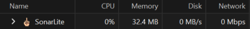
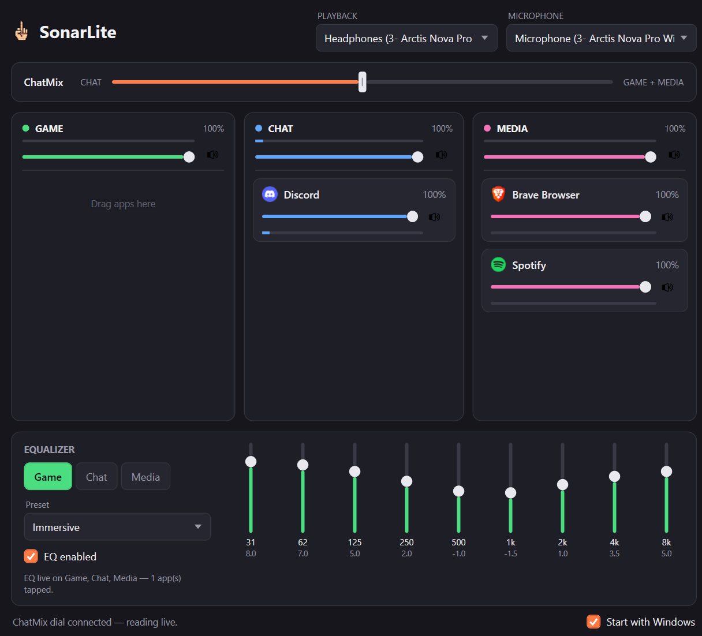

# SonarLite

SonarLite is a from-scratch rewrite of SteelSeries GG's **Sonar** mixer — without the rest of GG
riding along with it. Same job (per-app audio routing, independent per-bus EQ, the ChatMix
dial), minus the Electron shell and background services that keep GG idling at several hundred
MB of RAM. SonarLite is a native WPF app that idles under 50 MB — often a tenth of what GG costs
you for the same feature set:

## Features

- **Per-app routing** — drag any running app into a Game, Chat, or Media bus
- **Independent 10-band EQ per bus**, with presets (shown above: Immersive)
- **Live ChatMix dial** — read straight from the headset's hardware wheel, or drag it in-app
- **Per-bus volume and mute**, on top of each app's own level
- **Playback + microphone device pickers**, with automatic headset switching
- **Start with Windows**, tray-resident, no visible window until you open it

**This app is built specifically for the SteelSeries Arctis Nova Pro** — the ChatMix dial and
auto-switching talk to that headset's base station directly over USB HID, and won't recognize
anything else. If you have different hardware, feel free to fork it and adapt the HID layer.

## What you need before installing

SonarLite doesn't create virtual audio devices itself — it relies on one free driver to do that,
plus the .NET runtime to run on.

1. **Windows 10 or 11.**
2. **[.NET 8 Desktop Runtime](https://dotnet.microsoft.com/download/dotnet/8.0)** (the "Desktop
   Runtime" x64 installer, not just the ASP.NET or generic runtime). Skip this if you already
   have Visual Studio 2022+ with .NET 8 installed.
3. **[VB-Audio VB-Cable](https://vb-audio.com/Cable/)** — download the free "VB-CABLE Driver"
   zip (**not** the paid "VB-Cable A+B" pack), run `VBCABLE_Setup_x64.exe` as administrator, and
   reboot when it asks. This installs one virtual audio device pair named `CABLE Input` /
   `CABLE Output` — SonarLite looks for that exact name, so don't rename it during setup.

That's it — no other software required. In particular, SonarLite does **not** need Equalizer
APO or SteelSeries GG installed; all EQ runs in SonarLite's own DSP chain. (If you happen to have
an old Equalizer APO install left over from an earlier SonarLite version, it's harmlessly
detected and neutralized on startup — see `Services/EqualizerApoService.cs` — but a machine
without Equalizer APO never touches that code path at all.)

## Getting started

1. Install the two dependencies above and reboot.
2. Grab the latest zip from [Releases](https://github.com/jatmart/SonarLite/releases), unzip it
   anywhere, and run `SonarLite.exe`. No installer, nothing to build — it starts minimized to
   the system tray.
3. Open it from the tray icon. It auto-detects the VB-Cable device; assign running apps to a
   bus and adjust each bus's EQ from the window.
4. Plug in your Arctis Nova Pro — the ChatMix dial and auto-switching pick it up automatically,
   no extra configuration needed.

## Status

Actively developed, single-maintainer hobby project. Expect rough edges.

## License

MIT — see [LICENSE](LICENSE).
